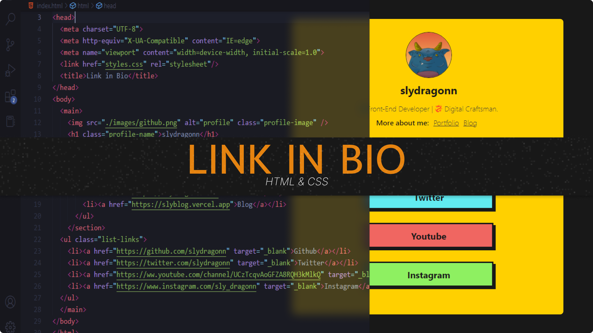
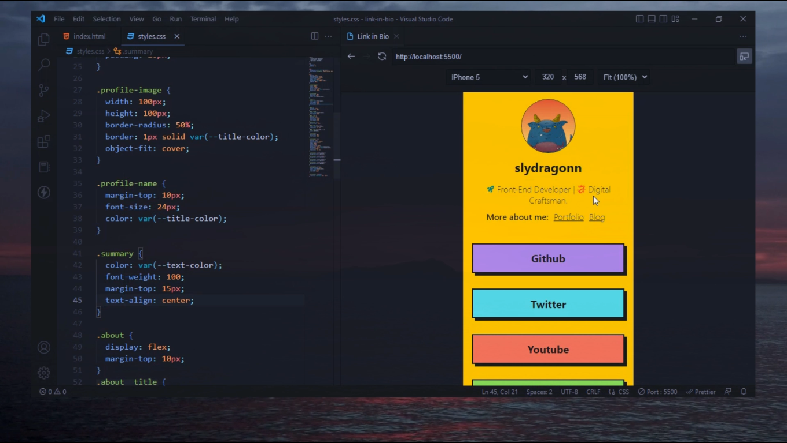

# Link in Bio page - slydragonn

'link in bio' page with only HTML and CSS (NO Frameworks).

- Clone this repo:

```bash
  git clone https://github.com/slydragonn/yt-link-in-bio.git
```

### [_See Video 🚀_](https://youtu.be/gF7wpKaeDE0)




- Final result of the video: [_How to create a link in bio page with only HTML and CSS_](https://youtu.be/gF7wpKaeDE0)

<p align="center"></p>